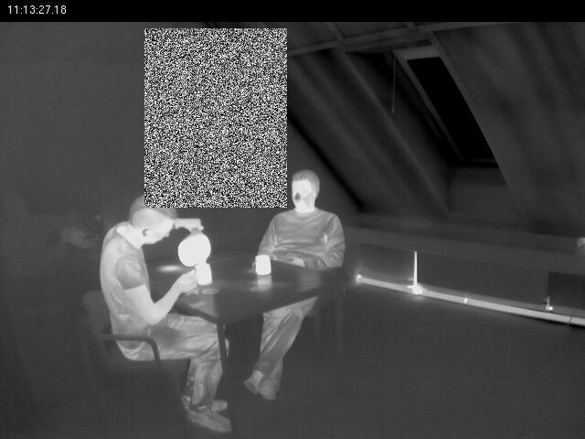
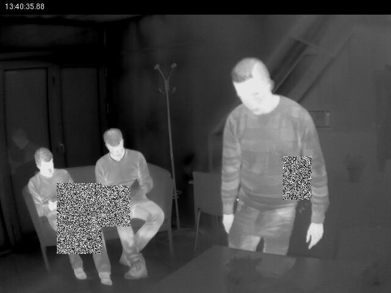

# augmentations

Augmentations are included in the `config.yaml` file that is stored with the zipped data sets. This file also includes the hyperparameters for the network training. This doc will just be talking about the augmentations part of that config file, the functionality of which are located in this repo.

## Strucure

Augmentations are stored in the augmentations list in the configuratoin `yaml` file. If there isn't already one in the config file you plan to use, just add it yourself. An example of a single augmenttion is shown here.

```yaml
augmentations:
  - type: 'random_erase'
    target_datasets: ['thermal_indoor.tar.xz'] 
    copy: True
    probability: 0.5
    args: []
    kwargs: {'mode': 'object'}
  - <Augmentation #2>
```

Each augmentation is an dictionary element of this list and had 6 mandatory keys:

1. `type`: This string specifies which augmentation is to be applied. The currenly available ones are `ranndom_erase` and `rotate_90`, wich are described below

2. `target_datasets`: This specifies to which datasets this augmentation will apply to. **An empty list will apply the augmentation to all datasets**. The datasets should match those named in the `config.yaml` files `datasets` list. The extensions for the datasets are optional (i.e. `rgb_data.7z` and `rgb_data` will both apply augmentations to the same dataset).

3. `copy`: This specifies if the original images are deleted or kept once an augmentation has been applied. `True` will keep the originals, `False` will delete them.

4. `probability`: This float specifies the probability this augmentation will apply to any given image in the dataset, sampled without replacement *for only this augmentation*. Once an augmentation has been fully applied, all augmented images are aded back to the temporarily stored dataset in Colab. Thus, augmentations specified in this configuration file compound (more below)

4. `args`: This is a list of in-order arguments that will be forwarded to this augmentation function. `[]` will forward none

5. `kwargs`: This is a dict of keyword arguments that will be forwarded to this augmentation function. `{}` will forward none

## Current augmentations

There are currently two augmentations, but making new ones is easy (see below).

### `rotate_90`

The image is rotated clockwise or counter-clockwise 90 degrees (with equal probability). I would put an example image here, but you know exactly what that means.

### `random_erase`

A rectangular region within the image is deleted and filled with grayscale random noise. See [this paper](https://arxiv.org/abs/1708.04896) for specifics about the algorithm. There are several parameters for this function, most of which specify the qualities of the erased region. The most important parameter is the `mode`. There are three modes of random erase:

- `image`: A single random region in the image is selected and erased. This region is selected irrespective of the objects in the image.
- `object`: For each bounding box in the image, a region is selected and erased.
- `image-object`: Both `image` and `object` level erasure are applied to the same image.

#### Image level random erase


#### Object level random erase


## Order and compounding

After a single augmentation is applied, the augmented images are returned to the local copy stored in the Colab environment. This same local store is where the images are pulled from to be augmented. This means that augmentations will compound. If you start ith 100 images, and conduct 2 augmentations with `probability=1.0` and `copy=True`. You will end up training on 400 images. This allows augmentations to be chained together for multiplicative effect and novel views.

## Writing your own augmentation

To write your own augmentation, just add it to this repo in the [right file](./augmentations.py). It should have the following functional interface:

```python
def augment_my_new_augmentation(img_path, annotation_path):
'''
arg img_path: String path to the image to augment
arg annotation_path: String path to the annoation text file associated with this image

returns: (pil_img, bboxes)
  pil_img: PIL image object of the augmented image (note, you don't need to save the image in this function)
  bboxes: List[List[class_id x_center, y_center width height]... ] annotation list of list in darknet format
          of bounding box positions for each box in the image. Should be relative coordinates [0, 1]
'''
  orig_img = Image.open(img_path)
  orig_bboxes = readAnnotation(annotation_path)
  
  #Do augmentation here
  # ...
  
  pil_img = orig_bboxes(orig_img)
  bboxes = special_function(orig_bboxes)
  
  return pil_img, bboxes
```

In order to make your new augmentation accessible through the config file, add a flag to it in the [appropriate spot](./augment.py#L80). The string selected here will be used to identify your augmentation in the `config.yaml` file. Be sure to add th appropriate import statement [at the top](./augment.py#L6) (because I can't fucking figure out how to get python packages to work properly ):

```python
...
elif augment_type == 'super_special_augmentation':
    augment_func = augment_my_new_augmentation
else:
    raise NotImplementedError(f'Augmentation type \'{augment_type}\' not supported')
```


